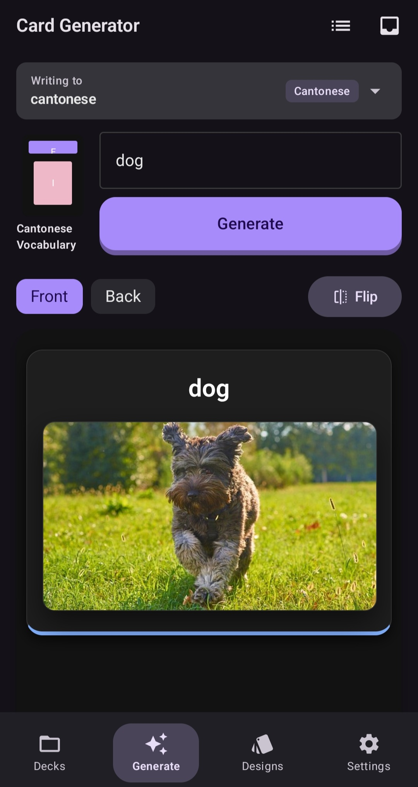
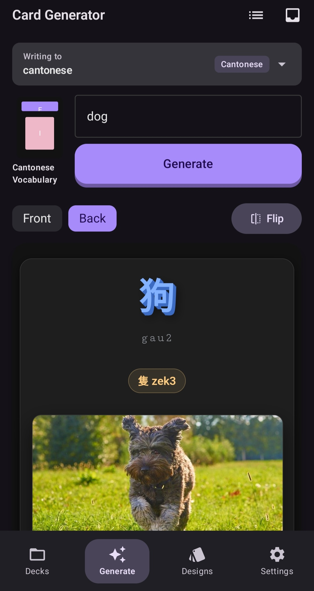
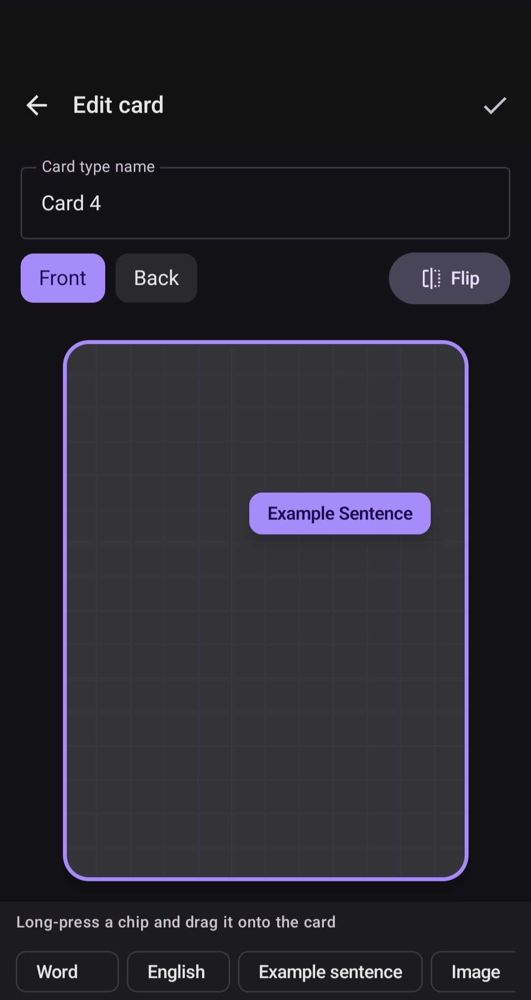
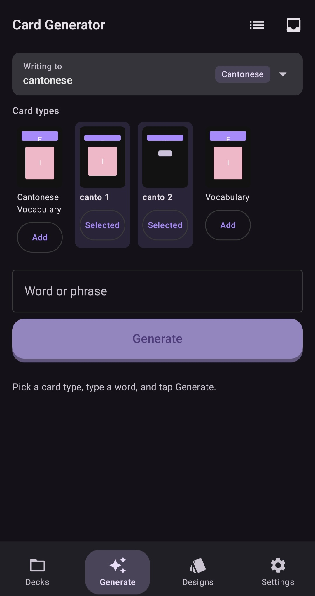

# Anki Card Manager

An Android app that turns a single word into a finished, media-rich flashcard and drops it straight into [AnkiDroid](https://github.com/ankidroid/Anki-Android). Type "dog", get a card with the target-language word, romanization, a definition, an example sentence, a classifier, an image, and native audio — reviewed and saved to your deck in a few taps.

It's built around **AnkiDroid** rather than replacing it. Decks, notes, and note types live in Anki and sync through your existing AnkiWeb account; this app is the fast, visual front end for designing card layouts and filling them with AI-generated content.

<p align="center">
  
  
  
  
</p>

> A personal project. I built it to make my own Cantonese study cards faster, then generalized it to other languages. It's not on the Play Store; the notes below are for reading the code and, if you want, running your own copy.

## What it does

- **One word in, a full card out.** A single structured LLM call returns every field at once (word, romanization, definition, example, classifier), then audio and imagery are fetched in parallel.
- **Visual card-type designer.** Drag fields onto a front/back canvas with a 3D flip. The layout is exported to Anki's template format (HTML + CSS + `qfmt`/`afmt`), so cards render the same inside AnkiDroid.
- **Images two ways.** Generate one with Gemini, or search real stock photos via Pixabay — switchable per card.
- **Native audio** per language, generated on demand.
- **Nine language presets** out of the box — Cantonese, Mandarin, Japanese, Thai, Spanish, French, German, Italian, plus a language-agnostic "Generic" preset for non-language decks. Adding a language is mostly a presets-file change.
- **Deck management** with nested subdecks and a per-deck language binding.
- **Share-to-app** — long-press a word in another app (e.g. Pleco), share it, and it's queued for generation without opening any UI.
- **Writes directly to AnkiDroid** through its `FlashCardsContract` content provider, so cards sync via AnkiWeb like any other note.

## How it works

The app never holds any API keys. It talks to a small personal proxy (a Vercel serverless function) that owns the credentials and gates every request behind a bearer token you set yourself.

```
┌─────────────────────┐      Bearer token       ┌──────────────────────┐
│  Android app        │ ──────────────────────► │  Vercel proxy        │
│  (Kotlin, Compose)  │                         │  (serverless fns)    │
│                     │ ◄────────────────────── │                      │
│  • card designer    │    JSON / MP3 / bytes   │  holds all API keys  │
│  • AI generation    │                         └──────────┬───────────┘
│  • deck management  │                                    │
└──────────┬──────────┘                     ┌──────────────┼───────────────┐
           │ FlashCardsContract             ▼              ▼               ▼
           ▼                          Gemini (Vertex)  Pixabay      Google TTS
   ┌───────────────┐                  text + image     stock photos  audio
   │   AnkiDroid   │  ── AnkiWeb sync ──►  your other devices
   └───────────────┘
```

Why a proxy at all:

- **Keeps API keys off the device.** The app ships with no secrets; a stolen APK exposes nothing.
- **Routes Google calls through Vercel's network,** which sidesteps the geo-blocks that otherwise force a VPN on the phone.

The token and proxy URL are entered once in the app's Settings screen and stored locally — there is nothing hardcoded to leak.

## Repository layout

```
anki-app/
├── anki-card-manager-android/   # The Android app (Kotlin, Jetpack Compose, MVVM)
│   ├── README.md                #   Full tech stack, code map, and setup
│   └── DOCS.md                  #   Architecture & contribution guidelines
├── anki-card-manager-proxy/     # The Vercel proxy (Node serverless functions)
│   └── README.md                #   Deploy-your-own walkthrough
└── docs/screenshots/            # Images used in this README
```

## Tech stack at a glance

**Android** — Kotlin 2.0, Jetpack Compose (Material 3), MVVM with a hand-rolled DI container, Coroutines + Flow, Retrofit/OkHttp, Room, DataStore. Min SDK 26, target 35.

**Proxy** — Node serverless functions on Vercel, `google-auth-library` for Vertex AI service-account auth.

**External services** — Gemini (via Vertex AI) for structured text and image generation, Pixabay for stock-photo search, Google Translate TTS for audio, and AnkiDroid's `FlashCardsContract` for everything Anki-side.

Full version tables and the reasoning behind each pin are in [`anki-card-manager-android/README.md`](anki-card-manager-android/README.md).

## Running your own copy

You'll need to stand up both halves:

1. **Deploy the proxy** — follow [`anki-card-manager-proxy/README.md`](anki-card-manager-proxy/README.md). It walks through deploying to Vercel's free tier, generating a proxy token, and wiring up the Gemini / Pixabay keys.
2. **Build the app** — follow [`anki-card-manager-android/README.md`](anki-card-manager-android/README.md). Open it in Android Studio, run it on a device with AnkiDroid installed, and paste your proxy URL + token into Settings.

## License

No license is granted. This is a personal portfolio project; the code is here to read, not to reuse as-is.
